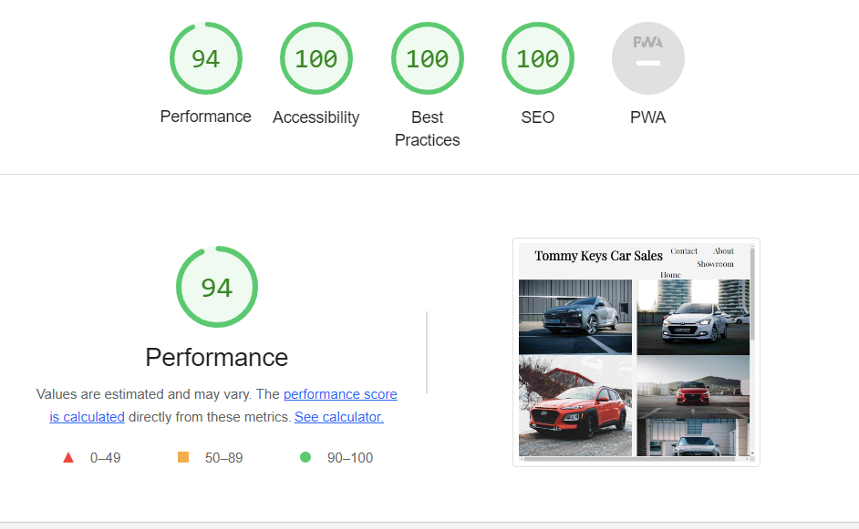

## Table of contents
1. [Purpose](#Purpose)

2. [User Experience](#User-Experience)
 * [Target Audience](#target-audience)
 * [User Expectations](#User-expectations)
 * [User Stories](#user-stories)

3. [Structure and Design](#Structure-and-Design)
 * [Website Structure](#website-structure)
 * [Colour](#Colour)
 * [Fonts](#Fonts)
 * [Wireframes](#Wireframes)

 4. [Technology Used](Technology-Used)
 * [Languages](#languages)
 * [Tools and Frameworks](#tools-and-frameworks)

 5. [Features](#Features)
 * [Logo and navigation bar](#logo-and-navigation-bar)
 * [Footer](#footer)
 * [Home Page](#home-page)
 * [Showroom](#showroom)
 * [Contact](#contact)
 * [Form](#form)
 * [Map](#map)
 * [About](#about)
 * [Youtube video](#youtube-video)

 6. [Validation](#validation)
 * [HTML validation](#html-validation)
 * [CSS validation](#css-validation)

 7. [Performance](#performance)
 
 

# Purpose
I built this website as my first project for the code institutes full stack development and e-commerce applications course. 
I built this website from scratch using the knowledge I gained from the course where I studied the basics of HTML and CSS. 

You can find a link to the live website [here](https://mcdaid101.github.io/tommy-keys-car-sales/).	

## Tommy Keys Car Sales

This website was built for Thomas Keys, a car dealership owner in the North West of Ireland. Mr Keys asked for a website which would be fully responsive and run across a multitude of devices such as phones, tablets and desktops and which would display his business in a positive light and bring more customers to the dealership. Mr Keys wanted a website to show his cars that were for sale, make it easy for customers to find the dealership and make contacting the dealership simple and also show people the story of his dealership and what they were about. 
 

# User Experience

## Target Audience 
* People looking to buy a new Hyundai Car 
* People looking to get in contact about test driving a new Hyundai 
* People looking to learn more about Tommy Keys car dealership 
 

## User Expectations 
* Simple and easyily navigated website
* Easy found information about the business 
* Fully functioning links and features 
* Easy found contact info
* Good design and presentation 
 

## User Stories
 

### As a first time user:
1. I want to learn more about the site and easily navigate it.
2. I want to be able to learn more about the business. 
3. I want to find out where exactly the business is located. 
4. I want to be able to view the website clealry on my mobile phone. 
5. I want to be able to find contact information easily. 
 

### As a returning user:
1. I want to be able to submit a call back request on the contact form. 
2. I want to be able to book a test drive for a new car that is coming out. 
3. I want to find out what days and times the dealership is open. 
 

### As a frequent user:
1. I want to view the online showroom to see what cars are available.
2. I want to check out the business's social medias which are linked to the site. 
3. I want to learn more about the business through their videos. 
 

### As the site owner:
1. I want users to be able to contact the business easily.
2. I want users to get to know my business. 
3. I want users to know where my business is located. 
 

# Structure and Design  
Each page on the site has the same header with the Tommy Keys Car Sales logo and the same navigation bar containing a home button, showrooom button, contact button and an about button. Similarly to the header navigation bar, each page has the same footer which contains links to Tommy Key's social media platforms. 
 

## Website Structure 
1. Home page containing a hero image with links to booking a test drive and to view the showroom 
2. Showroom containing a gallery of cars 
3. Contact contains a contact form with the option of booking a test drive and a map with the location of the business
4. About contains a link to a youtube video about the dealership 
 

## Colour
The website was designed to look modern and futuristic and appealing to those looking for new sleek vehicles. The colors whitesmoke (#f5f5f5) and regular grey are the main colors of each webpage are used to replicate the colour theme of most modern car showrooms. Modern car Showrooms are full of light and bright white shades which highlight the cars inside and make them the center of attention, something I have tried to recreate in this website.
For my elements with hover options I used a yellow colour (#e5cc5d) and a red colour (#e55d5d) to highlight being interacted with. 
 

## Fonts
The main font family used is imported from the Google Fonts website and is called 'Playfair Display', this font has been used extensively throughout the website as it looks professional and suits the theme of the website any other text areas are in 'sans serif' mainly which are less important and serve as non heading elements and text areas. 
 

## Wireframes
### Home 

### Showroom 

### Contact 

### About 

 

# Technology Used 
 

## Languages 
* HTML 
* CSS 
 

## Tools and Frameworks
* Git 
* Github 
* Google Fonts 
* Font Awesome
* GlassMorphism Generator 
* Vs Code in browser
 

# Features
This website contains 4 webpages
 

Expand for Screenshots of each page and feature

## Logo and navigation bar 

* The logo and nav bar are on each page 
* The nav bar and logo are fully responsive on every device screen size
* It includes links to the Home page through clicking on the logo and the Home button along with links to the showroom, contact and about pages
* When hovered over their is a red line to indicate you are interacting with it 
 

## Footer

* The footer is also present on every page 
* The footer contains a link to Facebook, Twitter, Instagram, Youtube and Tiktok
* It is fully responsive to different screen sizes 
 

## Home page

* This is the home page the first page users see
* Users have a link to the contact page through the book a test drive link and a link to the showroom to view other cars 
 

## Showroom 

* Showroom contains a gallery of cars 
* The gallery is fully responsive to any device screen 
 

## Contact 

* The contact page gives users the opportunity to contact the dealership or for the dealership to contact them
* The contact page contains a contact form with the option of booking a test drive 
* Telephone numbers, email and opening times are also present 
* An embedded location of the dealership on Google maps can also be used on the contact page 
* This page is fully responsive to any device screen 
 

## Form 

* The form is used as a contact point for users 
* Once their details are submitted the dealership can ring them back 
* It also allows them to book a test drive through a radio button
* Fully responsive to any device screen size 
 

## Map 

* An embedded google maps location of the dealership 
* Fully responsive to any device screen size 
 

## About 

* The About page gives users more information about Tommy Keys Car Sales and gives a bit of history behind the company
* An embedded youtube video tells the story of Tommy Keys Car Sales 
* This page is fully responsive to any device screen 
 

## Youtube video

* An embedded youtube video of the story of Tommmy Keys car sales
* Fully responsive to any device screen size 
 

 

# Validation 
 

## HTML validation 
I tested the website with the W3C HTML Markup validation service and fixed anything that failed.

HTML validation Screenshot

## CSS validation 
I tested the website with the W3C CSS Markup validation service and fixed anything that failed.

CSS validation Screenshot

 

# Performance 
Google lighthouse was used to test the performance of the website 

Home Page

Showroom

Contact

About

