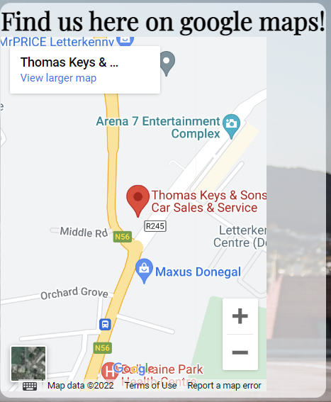
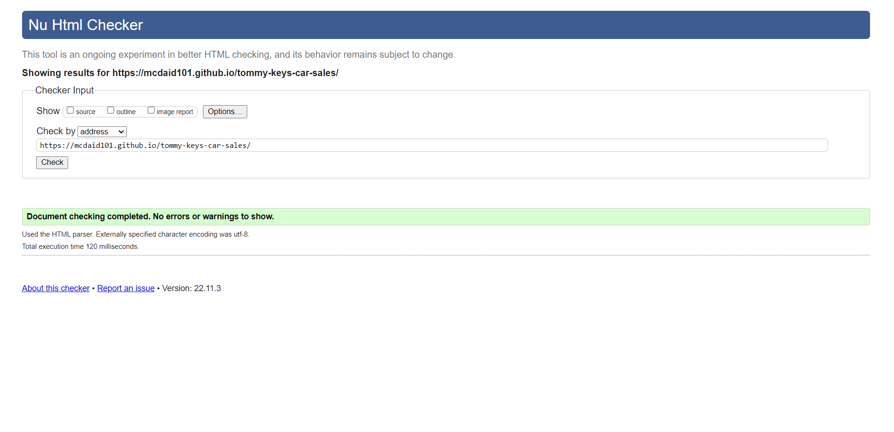

## Table of contents
1. [Purpose](#Purpose)

2. [User Experience](#User-Experience)
 * [Target Audience](#target-audience)
 * [User Expectations](#User-expectations)
 * [User Stories](#user-stories)

3. [Structure and Design](#Structure-and-Design)
 * [Website Structure](#website-structure)
 * [Colour](#Colour)
 * [Fonts](#Fonts)
 * [Wireframes](#Wireframes)

 4. [Technology Used](Technology-Used)
 * [Languages](#languages)
 * [Tools and Frameworks](#tools-and-frameworks)

 5. [Features](#Features)
 * [Logo and navigation bar](#logo-and-navigation-bar)
 * [Footer](#footer)
 * [Home Page](#home-page)
 * [Showroom](#showroom)
 * [Contact](#contact)
 * [Form](#form)
 * [Map](#map)
 * [About](#about)
 * [Youtube video](#youtube-video)

 6. [Validation](#validation)
 * [HTML validation](#html-validation)
 * [CSS validation](#css-validation)

 7. [Performance](#performance)
 * [Performance testing using different devices](#performance-testing-using-different-devices/browsers)

 8. [Testing](#testing)
 * [Testing User Stories](#testing-user-stories)

 9. [Bugs](#bugs)

 10. [Deployment](#deployment)
 * [Creating this project](#creating-this-project)
 * [Github pages](#github-pages)
 * [To run locally](#to-run-locally)

 11. [Credits](#credits)
 * [Code](#code)
 * [media](#media)
 * [Acknowledgements](#acknowledgements)

 

# Purpose
I built this website as my first project for the code institutes full stack development and e-commerce applications course. 
I built this website from scratch using the knowledge I gained from the course where I studied the basics of HTML and CSS. 

You can find a link to the live website [here](https://mcdaid101.github.io/tommy-keys-car-sales/).	

## Tommy Keys Car Sales

This website was built for Thomas Keys, a car dealership owner in the North West of Ireland. Mr Keys asked for a website which would be fully responsive and run across a multitude of devices such as phones, tablets and desktops and which would display his business in a positive light and bring more customers to the dealership. Mr Keys wanted a website to show his cars that were for sale, make it easy for customers to find the dealership and make contacting the dealership simple and also show people the story of his dealership and what they were about. 
 

# User Experience

## Target Audience 
* People looking to buy a new Hyundai Car 
* People looking to get in contact about test driving a new Hyundai 
* People looking to learn more about Tommy Keys car dealership 
 

## User Expectations 
* Simple and easyily navigated website
* Easy found information about the business 
* Fully functioning links and features 
* Easy found contact info
* Good design and presentation 
 

## User Stories
 

### As a first time user:
1. I want to learn more about the site and easily navigate it.
2. I want to be able to learn more about the business. 
3. I want to engage with interactive content such as a video.
4. I want to find out where exactly the business is located. 
5. I want to be able to view the website clealry on my mobile phone. 
6. I want to be able to find contact information easily. 
 

### As a returning user:
1. I want to be able to submit a call back request on the contact form. 
2. I want to be able to book a test drive for a new car that is coming out. 
3. I want to find out what days and times the dealership is open. 
 

### As a frequent user:
1. I want to view the online showroom to see what cars are available.
2. I want to check out the business's social medias which are linked to the site. 
3. I want to learn more about the business through their videos. 
 

### As the site owner:
1. I want users to be able to contact the business easily.
2. I want users to get to know my business. 
3. I want users to know where my business is located. 
 

# Structure and Design  
Each page on the site has the same header with the Tommy Keys Car Sales logo and the same navigation bar containing a home button, showrooom button, contact button and an about button. Similarly to the header navigation bar, each page has the same footer which contains links to Tommy Key's social media platforms. 
 

## Website Structure 
1. Home page containing a hero image with links to booking a test drive and to view the showroom 
2. Showroom containing a gallery of cars 
3. Contact contains a contact form with the option of booking a test drive and a map with the location of the business
4. About contains a link to a youtube video about the dealership 
 

## Colour
The website was designed to look modern and futuristic and appealing to those looking for new sleek vehicles. The colors whitesmoke (#f5f5f5) and regular grey are the main colors of each webpage are used to replicate the colour theme of most modern car showrooms. Modern car Showrooms are full of light and bright white shades which highlight the cars inside and make them the center of attention, something I have tried to recreate in this website.
For my elements with hover options I used a yellow colour (#e5cc5d) and a red colour (#e55d5d) to highlight being interacted with. 
 

## Fonts
The main font family used is imported from the Google Fonts website and is called 'Playfair Display', this font has been used extensively throughout the website as it looks professional and suits the theme of the website any other text areas are in 'sans serif' mainly which are less important and serve as non heading elements and text areas. 
 

## Wireframes
### Home 

### Showroom 

### Contact 

### About 

 

### Differences to wireframes
* Unable to get the menu nav bar to sit the way I planned in the wireframes.
 

# Technology Used 
 

## Languages 
* HTML 
* CSS 
 

## Tools and Frameworks
* Git 
* Github 
* Google Fonts 
* Font Awesome
* GlassMorphism Generator from Glass Ui
* Vs Code IDE in browser
* Chrome developer tools 
* Techsini Multi Device Mockup Generator used in this readme to display an image of the website on different devices 
 

# Features
This website contains 4 webpages
 

Expand for Screenshots of each page and feature

## Logo and navigation bar 

* The logo and nav bar are on each page 
* The nav bar and logo are fully responsive on every device screen size
* It includes links to the Home page through clicking on the logo and the Home button along with links to the showroom, contact and about pages
* When hovered over their is a red line to indicate you are interacting with it 
 

## Footer

* The footer is also present on every page 
* The footer contains a link to Facebook, Twitter, Instagram, Youtube and Tiktok
* It is fully responsive to different screen sizes 
 

* The Footer covers the first time user stories: 4.    
* Frequent user stories: 2.    
* Site owner needs: 2. 

## Home page

* This is the home page the first page users see
* Users have a link to the contact page through the book a test drive link
* Users have a link to the showroom to view other cars and 
* The dealership's opening times can be viewed at bottom of the page
 

* The Home page helps meet the first time user stories: 1, 4.
* Returning user stories: 2, 3.      
* Frequent user stories: 1, 2.     
* Site owner needs: 1, 2. 

## Showroom 

* Showroom contains a gallery of cars 
* The gallery is fully responsive to any device screen 
 

* The Showroom helps meet the first time user stories: 4.     
* Frequent user stories: 1, 2.     
* Site owner needs: 2. 

## Contact 

* The contact page gives users the opportunity to contact the dealership or for the dealership to contact them
* The contact page contains a contact form with the option of booking a test drive 
* Telephone numbers, email and opening times are also present 
* An embedded location of the dealership on Google maps can also be used on the contact page 
* This page is fully responsive to any device screen 
 

* The Contact page helps meet the first time user stories: 3, 4, 5.
* Returning user stories: 1, 2, 3.      
* Frequent user stories: 2.     
* Site owner needs: 1, 3. 

## Form 

* The form is used as a contact point for users 
* Once their details are submitted the dealership can ring them back 
* It also allows them to book a test drive through a radio button
* Fully responsive to any device screen size 
 

* The Contact page helps meet the first time user stories: 5.
* Returning user stories: 1, 2, 3.          
* Site owner needs: 1. 

## Map 

* An embedded google maps location of the dealership 
* Fully responsive to any device screen size 
 

* The Map helps meet the first time user stories: 3.   
* Site owner needs: 3. 

## About 

* The About page gives users more information about Tommy Keys Car Sales and gives a bit of history behind the company
* An embedded youtube video tells the story of Tommy Keys Car Sales 
* This page is fully responsive to any device screen 
 

* The About page helps meet the first time user stories: 1, 2, 3, 5.      
* Frequent user stories: 2, 3.     
* Site owner needs: 2. 

## Youtube video

* An embedded youtube video of the story of Tommmy Keys car sales
* Fully responsive to any device screen size 
 

* The Youtube video helps meet the first time user stories: 2, 3.     
* Frequent user stories: 3.     
* Site owner needs: 2. 

 

# Validation 
 

## HTML validation 
I tested the website with the W3C HTML Markup validation service and fixed anything that failed.

HTML validation Screenshot

## CSS validation 
I tested the website with the W3C CSS Markup validation service and fixed anything that failed.

CSS validation Screenshot

 

# Performance 
Google lighthouse was used to test the performance of the website 

Home Page

Showroom

Contact

About

 

## Performance testing using different devices/browers
The website was tested on three devices:
* Apple Ipad Air 
* Apple Iphone XR 
* ASUS vivobook 
* Chrome developer tools were also used in the testing process with its many different device toggling options. 
The following browsers were used in compatability testing:
* Google Chrome 
* Microsoft Edge
Site fully functioning on each device and browser 

# Testing 

## Testing User Stories
 

## First time stories 
* As a first time user: I want to learn more about the site and easily navigate it.  
Testing done to make sure that all links work so all users can easily navigate the page and eveyrthing is fully visible. 

First time user 1

| **Feature** | **Action** | **Expected Result** | **Actual Result** |
|-------------|------------|---------------------|-------------------|
|Nav bar | Check links on nav bar bring you to same page they are named after | Links when clicked bring you to page they are named after | Works as expected |

 
 

* As a first time user: I want to be able to learn more about the business.  
 Testing done to ensure that the link to the about page is working and the text area and embedded youtube video is responsive to any device screen.

First time user 2

| **Feature** | **Action** | **Expected Result** | **Actual Result** |
|-------------|------------|---------------------|-------------------|
| About page | Click on about on nav bar and check that link brings you to about page | About button brings user to About page where they can learn more about the business | Works as expected |

 
 

* As a first time user: I want to engage with interactive content such as a video. 
 Testing done to ensure the youtube video on the about page is capable of playing along with changing the level of audio, also ensured it is responsive to any device screen.

First time user 3

| **Feature** | **Action** | **Expected Result** | **Actual Result** |
|-------------|------------|---------------------|-------------------|
|Youtube video | Navigate to about page and click on youtube video and check it plays  | Youtube video should be responsive to any device and have no problem playing video | Works as expected |

 
 

* As a first time user: I want to find out where exactly the business is located.  
 Testing done to ensure the link to the contact page is working and the embedded google map is functioning and showing the exact location of the car dealership. 

First time user 4

| **Feature** | **Action** | **Expected Result** | **Actual Result** |
|-------------|------------|---------------------|-------------------|
|Map |Navigate to the contact page and view the embedded google maps of dealership location  | Google maps should be seen on any device screen as it is fully responsive | Works as expected |

 
 

* As a first time user: I want to be able to view the website clealry on my mobile phone.  
 Testing done to ensure that the entire website is fully responsive to any mobile device using chrome developer tools and physical Iphone and Ipad. 

First time user 5

| **Feature** | **Action** | **Expected Result** | **Actual Result** |
|-------------|------------|---------------------|-------------------|
|Entire website |Checked through chrome developer tools that the site is fully responsive across different screen sizes | The website is responsive over any screen size | Works as expected |

 
 

* As a first time user: I want to be able to find contact information easily.  
Testing done to ensure the links to the contact page are fully functioning and the contact form/box is fully visible and easily read. 

First time user 6

| **Feature** | **Action** | **Expected Result** | **Actual Result** |
|-------------|------------|---------------------|-------------------|
|Contact button | Navigate to contact page and ensure link brings you there, ensure the contact information below the form is clearly visible applying a blurred background to make the text more readable  | Able to navigate to the contact page successfully and easily find the contact info | Works as expected |

 
 

## Returning stories 
* As a returning user: I want to be able to submit a call back request on the contact form.  
 Testing done to ensure that the form on the about page has working input boxes with the correct input types, along with a functioning radio button and submit and reset buttons.

Returning user 1

| **Feature** | **Action** | **Expected Result** | **Actual Result** |
|-------------|------------|---------------------|-------------------|
|Contact form |Navigate to the contact page, fill in the form entering your name, email and phone number and click submit form  | The contact form submits successfully | Works as expected |

 
 

*  As a returning user: I want to be able to book a test drive for a new car that is coming out.  
 Testing done to ensure that the yes and no radio buttons that give the option of arranging a test drive are fully functioning along with the submit and reset form buttons. 

Returning user 2

| **Feature** | **Action** | **Expected Result** | **Actual Result** |
|-------------|------------|---------------------|-------------------|
|Contact form |Navigate successfully to the contact form from the nav bar's page contact and fill in the form and click the yes radio button followed by submit |Code institute page will appear saying you have submitted your form successfully | Works as expected |
|Book a test drive link on the home page | Navigate successfully to the contact form from the home page's book a test drive link and fill in the form and click the yes radio button followed by submit | Code institute page will appear saying you have submitted your form successfully | Works as expected |

 
 

* As a returning user: I want to find out what days and times the dealership is open. 
Testing done to ensure the link to the contact page is working and the what time and days the business are open on.

Returning user 3

| **Feature** | **Action** | **Expected Result** | **Actual Result** |
|-------------|------------|---------------------|-------------------|
|Opening days and times at bottom of home page | Navigate to the bottom of the home page and view the opening times  | Opening times can be viewing clearly in a yellow color at the bottom of the home page | Works as expected |
| Opening days and times at the bottom of the contact form | Navigate to the bottom of the contact page and view the opening times at the bottom of the form  | Opening times can be viewing clearly at the bottom of the form | Works as expected |

 
 

## Frequent stories 
* As a frequent user: I want to view the online showroom to see what cars are available.  
Testing done to ensure that the links to the showroom page are active and that every image of each car is easily visible and responsive to any device screen size.

Frequent user 1

| **Feature** | **Action** | **Expected Result** | **Actual Result** |
|-------------|------------|---------------------|-------------------|
|Showroom button on nav bar  | Check link on the nav bar brings you to the showroom | Link on nav bar brings you to the showroom | Works as expected |
| Link to view other cars on the home page |check link on home page brings you to showrooom | Link brings you to showroom  | Works as expected |

 
 

* As a frequent user: I want to check out the business's social medias which are linked to the site.  
Testing done to ensure that each social media link on the footer of each page is working and sends the user to the correct site in a new tab. 

Frequent user 2

| **Feature** | **Action** | **Expected Result** | **Actual Result** |
|-------------|------------|---------------------|-------------------|
|Footer |Check links on the footer bring you to each social medias site in a different tab | each icon's link brings you to its assigned social media website  | Works as expected |

 
 

* As a frequent user: I want to learn more about the business through their videos.  
Testing done to ensure that the link to the about page is fully funcioning and the embedded youtube and it's functions are working and are responsive to any screen size. 

Frequent user 3

| **Feature** | **Action** | **Expected Result** | **Actual Result** |
|-------------|------------|---------------------|-------------------|
|Youtube video | Navigate to about page and click on youtube video and check it plays  | Youtube video should be responsive to any device and have no problem playing video | Works as expected |

 
 

## Owner stories 
* As the site owner: I want users to be able to contact the business easily.  
Testing done to ensure that users on the site can easily navigate to the contact page and see the contact info clearly on the page along with a contact form which can be filled out to arrange a call back from the business. 

Site owner 1

| **Feature** | **Action** | **Expected Result** | **Actual Result** |
|-------------|------------|---------------------|-------------------|
|Contact button | Navigate to contact page and ensure link brings you there, ensure the contact information below the form is clearly visible applying a blurred background to make the text more readable  | Able to navigate to the contact page successfully and easily find the contact info | Works as expected |
|Form | Navigate to contact page and ensure link brings you there, ensure the form can be submitted with the users details so the business can call them back | Able to navigate to the contact page successfully and easily find the contact info and submit the users details| Works as expected |
| Footer| Ensure social media links work so user can contact business through them | the social media links bring the user to the business social media | Works as expected |

 
 

* As the site owner: I want users to get to know my business.  
Testing done to ensure that links to the about page are fully functioning and information about the business is clearly visible and presented well along with a functioning and fully resposive youtube video.

Site owner 2

| **Feature** | **Action** | **Expected Result** | **Actual Result** |
|-------------|------------|---------------------|-------------------|
|About page | Check to see the about page can be navigated to, it's text is clearly visible against the hero image background and its youtube video can be played and is fully responsive on any device | About page navigated to easily and text is visible and everything is fully responsive | Works as expected |

 
 

* As the site owner: I want users to know where my business is located.  
Testing done to ensure users can easily navigate to the contact section and see the location of the dealership on the fully responsive google maps which is displayed on the page. 

Site owner 3

| **Feature** | **Action** | **Expected Result** | **Actual Result** |
|-------------|------------|---------------------|-------------------|
|Map | Navigate to the contact page and see the google maps embedded live image of the dealership's location  | After navigating to the contact page you will see a google maps map of the dealerships exact location | Works as expected |
| |  |  | Works as expected |

 

# Bugs 

| **Bug** | **Fix** |
| ----------- | ----------- |
|Text on certain pages was hard to read against the image background beneath it.  | Used the glass morphism generator code from Glass Ui to blur the background slightly making the text more readable. |
| The form and map on the Contact page were failing to fit on the page when viewed from a mobile |Changed the display to flex and used a media query to change the display from a column to a row. |
| The user was able to submit the contact form with nothing inputted to the text boxes.  | Added a required attribute to the input fields. |
| Youtube video failing to be responsive to any other device screen size than the one I had initially embedded it on. | Placed the Iframe within a container and gave it the position of relative and gave the Iframe itself a position of absolute, this made the youtube video responsive.  |

# Deployment 

## Creating this project
This project was created by navigating to the Code Institute's student template and clicking the 'use this template' button. I then inputted the repository name "tommy-keys-car-sales" and included all branches. With the repository now created, I used the browser version of Vs Code to create the project. 
 

I used the following commans throughout this project:
* Git add . - This added my file to the staging area to be committed
* Git commit -m - This command committed any changes to the local repository along with a message
* Git push - pushed my changes to the github repository 

## Github pages 
1. Navigate to the tommy-keys-car-sales repository 
2. Click on settings
3. Click on pages 
4. Select 'master branch' as source 
5. Then save 
6. Link is then generated to go to the live page 

## To run locally 
1. Navigate to the tommy-keys-car-sales repository 
2. Click the code drop down menu 
3. Click download as Zip
4. Open with IDE of choice 
5. Or 
6. open a terminal in an IDE and use git clone command followed by your git URL of the repository 
7. The project will then be created in your IDE

# Credits 

## Code 
* The blurred effect over the hero image on the home page, behind the form and map and text on the contact page is taken from the GlassMorphism Generator from [Glass UI](https://ui.glass/generator/).
* The showrooms gallery code and media query is inspired by the code institutes [love running project](https://github.com/Code-Institute-Solutions/Love-Running-Solutions).
* The code which made the embedded youtube video on the about page responsive was taken from a youtube video by [TipswithPunch](https://www.youtube.com/watch?v=9YffrCViTVk)

## Media 
* Contact page background photo by Martin Katler on [Unsplash](https://unsplash.com/photos/ojet5e6Fzcc)
* Home page background photo is by the Hyundai Motor Group on [Pexels](https://www.pexels.com/photo/front-view-of-white-hyundai-car-on-wet-road-11482358/)
* car1.jpg by Hyundai Motor Group on [Pexels](https://www.pexels.com/photo/latest-model-of-hyundai-car-11158776/)
* car2.jpg by Erik Mclean from [Pexels](https://www.pexels.com/photo/red-hyundai-parked-on-gray-concrete-pavement-4077271/)
* car3.jpg Photo by Erik Mclean from [Pexels](https://www.pexels.com/photo/photo-of-white-car-on-wet-road-9846121/)
* car4.jpg Photo by Louis de Gonzague Kubwimana from [Pexels](https://www.pexels.com/photo/photo-of-red-vehicle-on-the-road-9521979/)
* car5.jpg Photo by As3dht from [Pexels](https://www.pexels.com/photo/hyundai-14158895/)
* car7.jpg Photo by Hyundai Motor Group from [Pexels](https://www.pexels.com/photo/white-car-parked-in-the-garage-11194510/)
* car8.jpg Photo by Velroy Fernandes from [Pexels](https://www.pexels.com/photo/a-black-hatchback-car-on-the-road-8984923/)
* car-salesman.jpg Photo by Antoni Shkraba from [Pexels](https://www.pexels.com/photo/a-salesman-talking-to-a-couple-7144253/)
* The youtube video on the About page is from [Hyundai Ireland](https://www.youtube.com/watch?v=uRTZN9vb7MI)

## Acknowledgements 
* I'd like to thank my mentor Ronan Mc Clelland for his help and advice through this project, especially for any additional resources he provided to help solve any bugs I was experiencing. 
* My girlfriend Lucy for her help on some of the visual aspects of the website and her overall support. 
* Anyone who has helped me on slack in my code institute cohort. 
* And finally my grandfather Thomas keys who owns a car dealership and garage in Letterkenny, County Donegal and sold me my first car a Hyundai i30. The main inspiration behind this website. 